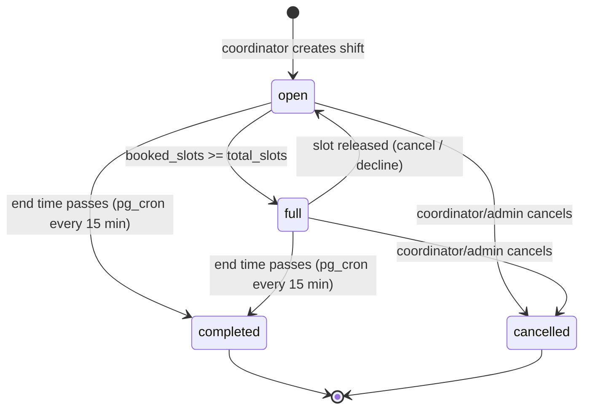

# Shift Lifecycle

The canonical reference for how shifts move through status, what actions
are allowed at each stage, and which layer enforces each invariant.

## State diagram

`open → full → open` is reversible via `update_shift_status()` (baseline).
`completed` and `cancelled` are terminal — `update_shift_status()` refuses
to mutate them back.

## Canonical definitions

| Term | Definition | Source of truth |
|------|------------|-----------------|
| **Upcoming** | `shift_end_at(shift_date, end_time, time_type) > now()` | `public.shift_end_at()` (SQL) + `isUpcoming()` (TS) |
| **Past** | `shift_end_at(…) <= now()` | Same |
| **Bookable** | `status IN ('open','full')` AND upcoming | `isBookable()` + DB triggers |
| **Editable** | `status NOT IN ('completed','cancelled')` | `isEditable()` + `enforce_completed_shift_immutability` |

Status filters (`open`, `full`, `completed`, `cancelled`) **layer on top of**
date-based upcoming/past filters. Never use status as a proxy for "not past."

## Timezone

All shift times are interpreted as **America/Chicago** wall-clock. This is
hardcoded in `public.shift_end_at()` (baseline, line ~2153). The pg_cron
schedule ticks in UTC but the underlying function converts — no DST-aware
adjustment needed in cron config.

## Completed-shift invariants

Once `status = 'completed'`:

| # | Invariant | Enforcement layer | Specific enforcer |
|---|-----------|-------------------|-------------------|
| 1 | Immutable core fields (`shift_date`, `start_time`, `end_time`, `time_type`, `total_slots`, `department_id`) | **DB trigger** | `trg_enforce_completed_shift_immutability` → `public.enforce_completed_shift_immutability()` (migration `20260415000000_shift_lifecycle_rules.sql`) |
| 2 | No new bookings (INSERT) | **DB trigger** | `trg_block_bookings_on_completed_shifts` → `public.block_bookings_on_completed_shifts()` (status-based); complements time-based `enforce_shift_not_ended_on_booking` from baseline |
| 3 | No cancellations of the shift itself | **DB trigger** | `public.update_shift_status()` (baseline) short-circuits on `status IN ('cancelled','completed')` |
| 4 | Check-in window closed | **Existing time-based guards** | Edge function `validate_checkin_token` and trigger `enforce_shift_not_ended_on_booking` already reject checked-in writes after shift end. No status-specific guard needed — by definition the shift has ended. |
| 5 | Existing bookings cannot be DELETEd (audit trail) | **DB trigger** | `trg_prevent_delete_bookings_on_completed_shifts` → `public.prevent_delete_bookings_on_completed_shifts()` |
| 6 | Hours finalized | **Convention** (not currently DB-enforced) | Coordinators update attendance/hours via `coordinator_hours_confirmation` flow; `hours_source` and `confirmation_status` are still updatable. See "Known gaps" below. |
| 7 | Notifications suppressed | **Existing cron filters** | `send_self_confirmation_reminders` and `warn_expiring_documents` already scope their queries to active/confirmed bookings in upcoming time windows. No completed-shift reminders fire because the date guard excludes them. |
| 8 | Appears in "Past" views only, never "Upcoming" | **Frontend + DB** | `src/lib/shift-lifecycle.ts` helpers (`isUpcoming`, `isPast`, `filterUpcoming`, `filterPast`) used by `AdminDashboard.tsx`, `CoordinatorDashboard.tsx`, `VolunteerDashboard.tsx`, `BrowseShifts.tsx` |
| 9 | Coordinators can still add notes / mark attendance / submit ratings | **DB trigger allow-list** | `enforce_completed_shift_immutability` explicitly blocks only the 6 core scheduling fields; `coordinator_note`, `note_updated_at`, `updated_at`, and `status` (already protected elsewhere) flow through |
| 10 | Reporting / CSV / PDF exports include completed shifts | **App convention** | `AdminDashboard.tsx#handleExportAll` and `CoordinatorDashboard.tsx#handleExportHours` filter by `confirmation_status = 'confirmed'`, not by shift status, so completed shifts appear correctly |

## Frontend enforcement (buttons / forms)

Defense-in-depth: users should never see a button that will only 500 on click.

| Component | Action | Guard |
|-----------|--------|-------|
| `ManageShifts.tsx` edit row | Edit (pencil) | `disabled={s.status === "completed"}` |
| `ManageShifts.tsx` delete row | Delete (trash) | `disabled={s.status === "completed"}` |
| `AdminDashboard.tsx` cancel row | Cancel button | Conditional on `s.status === "open" \|\| s.status === "full"` (existing — naturally excludes completed) |
| `BrowseShifts.tsx` | Book button | `SlotSelectionDialog` only renders for shifts in `open`/`full` status + `shiftEndAt > now` (existing) |

## Transition job

- **Function:** `public.transition_past_shifts_to_completed()` — returns `integer` (row count transitioned).
- **Schedule:** `cron.schedule('shift-status-transition', '*/15 * * * *', ...)` — every 15 minutes.
- **Idempotent:** only targets `status IN ('open','full') AND shift_end_at(...) <= now()`. Re-running is safe.
- **Local dev:** the migration includes a one-time backfill call at the end so existing stuck rows get flipped on first apply. This immediately fixes the Apr 9–17 shifts reported in the bug.

## Edge cases & notes

- **No-show attendance:** Coordinators mark attendance via `coordinator_hours_confirmation` / `shift_bookings.confirmation_status`. These columns are allow-listed by the immutability trigger (it only blocks the 6 core scheduling fields). Works on completed shifts.
- **Late coordinator check-in:** If a coordinator arrives at the table after the shift has auto-transitioned to `completed`, they can still mark attendance (see above). Bookings' `confirmation_status`, `checked_in_at`, and `checked_out_at` are not blocked.
- **Manual admin override:** The admin dashboard has no UI to roll a completed shift back to `open`/`full`. If this is ever needed, a service-role SQL update is required — `update_shift_status()` short-circuits on completed, so a direct `UPDATE shifts SET status='open'` by postgres/service_role is the only path.
- **Recurring shifts:** Each generated child row has its own `shift_date` / `end_time` and transitions independently. The `recurrence_parent` column is unaffected.
- **Sub-slot behavior (per-slot bookings):** If the per-slot booking feature lands (see `feature/per-slot-booking` plan), each booking row's `time_slot_id` should be considered when defining "past" at slot granularity. Today, the shift-level `shift_end_at` drives both triggers and frontend filters.

## Coordinator-initiated cancellation flow

The "Cancel shift" action on `/coordinator/manage` is a soft-delete:

1. `src/lib/shift-cancel.ts::cancelShiftWithNotifications` reads the
   confirmed bookings, then issues `UPDATE shifts SET status='cancelled'
   ... RETURNING id`. The `RETURNING id` is load-bearing: PostgREST
   returns 200 + empty array when RLS filters the row out, so without
   it the helper cannot distinguish a real success from an RLS denial.
   (Audit 2026-04-28: the previous code lacked `.select()` and surfaced
   "Shift deleted" toasts on no-ops.)
2. All confirmed `shift_bookings` for the shift are then UPDATEd to
   `cancelled` with `cancelled_at = now()`. Failure here is non-fatal —
   the shift is already cancelled and filtered from the volunteer view.
3. One `notifications` row per affected volunteer is INSERTed with
   `type='shift_cancelled'` and `data` carrying the original time
   window, optional cancellation reason, and `sms_eligible` flag. The
   DB notification webhook fans these out to email + SMS based on
   per-user prefs and the global `SMS_ENABLED` env flag.

The hard `DELETE` policies (`shifts: admin delete`,
`shifts: coord delete cancelled`) remain in place. The coordinator UI
never reaches them — the only coordinator-facing destructive action is
the soft-cancel above. Hard deletion of cancelled shifts is operator-
only via SQL or the admin Danger Zone (out of scope for the soft-delete
flow).

### SMS gating contract

`data.sms_eligible` on a `shift_cancelled` notification is `true` iff
the cancellation happened within 24h of the shift's start time. The
notification webhook reads this flag to decide whether to invoke
Twilio for THIS notification — long-lead cancellations (>24h) send
email + in-app only. The full predicate is at
`src/lib/notification-sms-gate.ts` and pinned by tests in
`src/lib/__tests__/notification-sms-gate.test.ts`.

The webhook duplicates the predicate inline because it lives in the
Deno module system and can't import from `src/`. Keep the two in sync.

## Known gaps

1. **Invariant #6 (hours finalized)** is a convention, not a DB rule. `hours_worked` and related numeric fields on `shift_bookings` remain UPDATE-able on completed shifts, which is by design (coordinators need to correct hours after the fact). Adding a hard lock would require an explicit "coordinator-sign-off" state.
2. **Cancelled shifts** have weaker DB enforcement than completed — they're mostly filtered out at the query layer. Future work: a symmetric `enforce_cancelled_shift_immutability()` trigger.

## Adding a new status

To introduce a new status (e.g. `"archived"`):

1. `ALTER TYPE public.shift_status ADD VALUE 'archived';` in a new migration.
2. Decide where the new status sits relative to the upcoming/past split — update `isUpcoming/isPast` (both TS and the SQL concept) accordingly.
3. Update the state diagram above.
4. Update enforcement layers: if the new state is terminal, extend `update_shift_status()`'s short-circuit list and decide whether to mirror the `enforce_completed_shift_immutability` pattern.
5. Update frontend status dropdowns in `AdminDashboard.tsx` and any filter that enumerates statuses.
